# 04-Quiz-App
Quiz App with timer using HTML, CSS and JS
This application uses JavaScript WebAPI's, CSS and  HTML to create a quiz application.

This project has been deployed to GitHub Pages. To access this project click the deployment link below:

https://github.com/dgourley84/04-Quiz-App

Or, download the sources files to use this as a template.

# Getting Started

This project has been deployed to GitHub Pages. To access this project click the deployment link below. Or, download the sources files to use this as a template.
-  https://github.com/dgourley84/04-Quiz-App
-  https://dgourley84.github.io/04-Quiz-App/

# Pre-requisites
If you wish to use this as a template you will need a text editor. Visual Studio Code was used to create this project and is the recomended application.

# Installing

To install this code, download the zip file, or use GitHub's guidelines to clone the repository.

# Summary
HTML and CSS and Javascript documents create a Quiz App. This project uses basic Javascript to make dynamic changes to an HMTL document with the goal of completing the quiz in a set time and then logging the score in local storage upon completion.
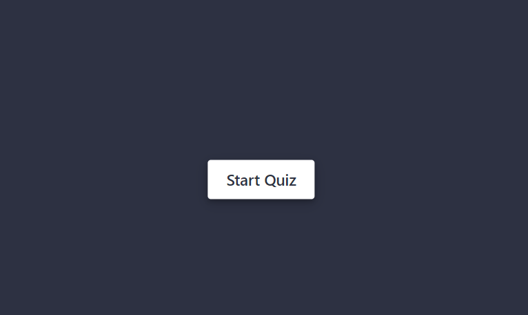

# Features
This project has the following features:
## A start button
This button is presented on the landing page.

Once pressed the following code is run with the purpose of presenting the rules to the user:
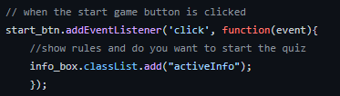

## Rules
The rules are then presented with the options to either exit or continue:

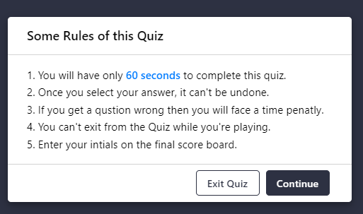

## Quiz

Upon selction continue the user is presented with the questions:

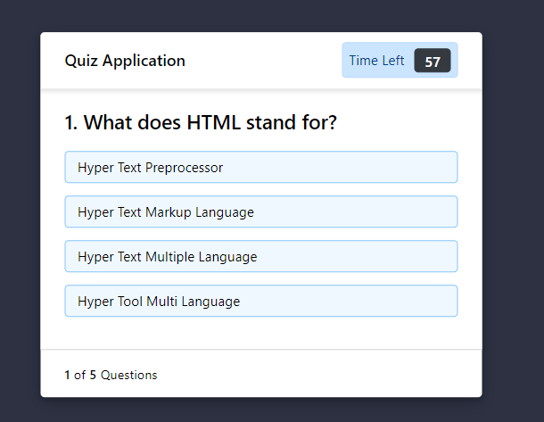

As part of the quiz box there are the following elements:
-   question number;
-   question options;
-   timer left;

the code for each of these is below with the objective of each detailed.

### Timer
The timer is set to 60 seconds with a 10 second run off penalty for an incorrect answer. The time code is as follows:

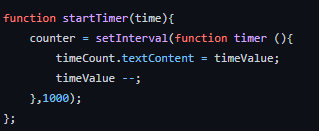

### Question number
The question number is not only performs the function of showing the user what question they are on but also is key to pulling the question information from the question array and cycling through those:

#### Question code
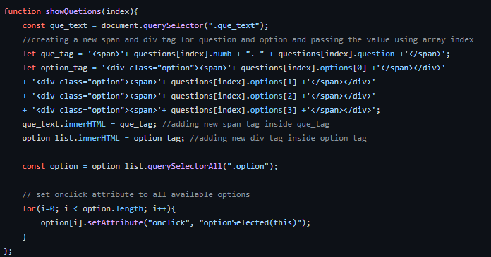

There is also an attribute set to listen for a click on any of the options chosen in order to log the answer.
#### Question Array/Options
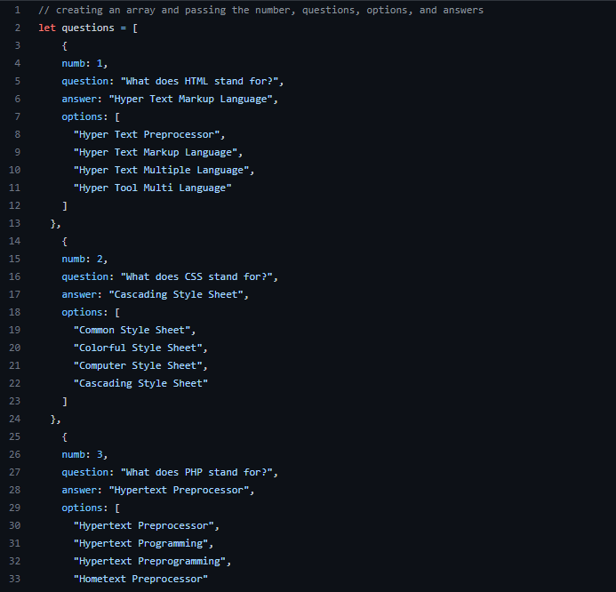

There is also an attribute set to listen for a click on any of the options chosen in order to log the answer.

## Options selection
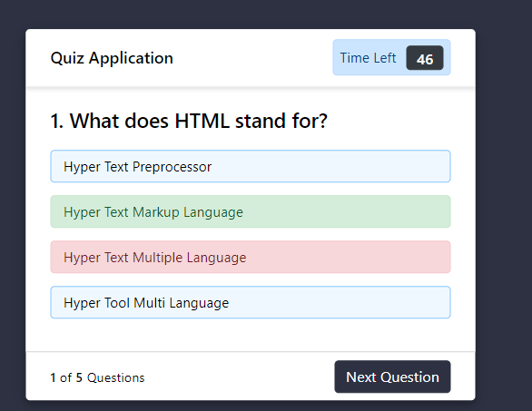

Upon selecting a response the user is presented with the result. If correct they will have a green highlight around their answer, if not the answer they chose will be highlighted red. The correct answer will be presented to them and a time penalty imposed. The code is as follows:

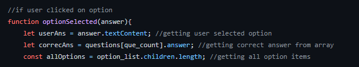
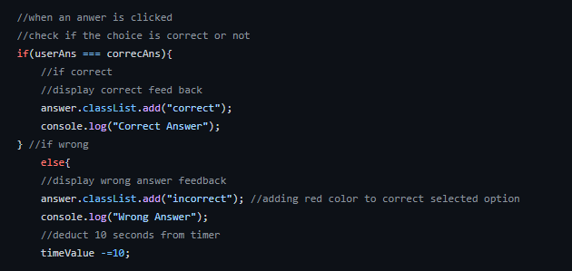
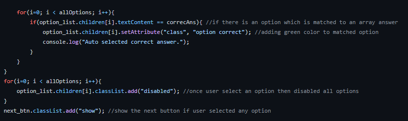

The user then has access to the next question button.

## Next Question
Upon selcing the next question button an if function is run to check that the question number is less than the array lenght and if so presents the next question by cycling the quesiton index. It will also remove the next button.

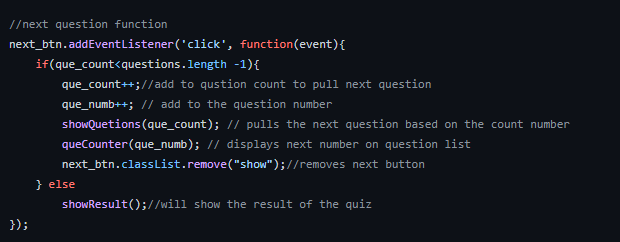

If it is the last question the showResult function runs which begins the end game procedures.

## Show Result
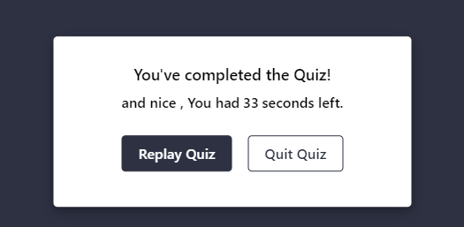

Upon completion of all questions the user is presented with a result. This function does the following:
- removes the quiz
- stops the timer
- records the time left as the result
- presents message to the user for their acheivement

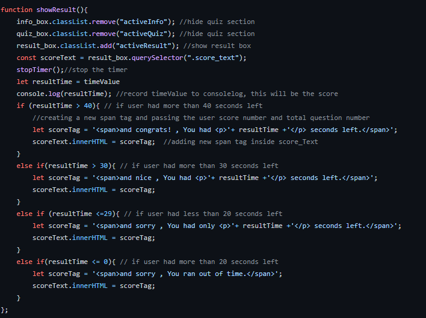

# To Execute File:

Open in browers and follow the prompts

# Features:

- one HTML Page
    - index.html
        - contains basic structure of the page along with class id's and divs to enact JS commands
- one CSS Page
    - style.css
        - contains all css used for styling as well as hiding and showing the boxes as per the JS commands
- two JavaScript pages
    - questions.js 
        - the questions with the array and insturctions on how to add further questions
    - script.js
        - all the JS script and functions to run the quiz and enact changes to the html and css

# Authors

- Dallas Gourley
- Various code found online and repurposed to fit the requirements

# Acknowledgments
Thanks to Sam Ngu, Evan Woods and Navepreet Ahuja for tutorial guidence and inspiration.